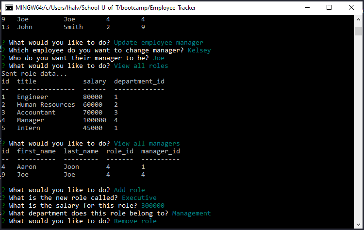

# Employee Tracker

I was tasked with creating an interface that made it easy for non-developers to view and interact with information stored in databases.  This is a **C**ontent **M**anagement **S**ystem that allows users to manipulate employee data such as add employee, view all managers and much more.

## 🍔 Getting started

####  🐑 Cloning

1. [Fork this repository](https://help.github.com/en/articles/fork-a-repo).
1. [Clone the forked repository](https://help.github.com/en/articles/cloning-a-repository) locally
1. Run `npm install` to install dependencies

## 💥 Issues

The main challenge was the amount of coding that this project needed. Figuring out inquirer along with the orm system was definitely a challenge.

## 🍤 Contribution:

[Code of Conduct](./CODE_OF_CONDUCT.md)

## 👌 Collaborators

With instruction from [Filipe Laborde-Basto](https://github.com/c0dehot) and [Daniel Cabellos](https://github.com/shibeknight)

## ☕ License:

For more information about the license, click on the link below.

- [License](https://choosealicense.com/licenses/mit/)

## ❔ Questions:

For questions about this project you can go to my GitHub page at the following link:

- [GitHub Profile](https://github.com/Halvosaurus34)

For additional questions please reach out to me at: lhalvorson34@gmail.com.

---

## 🎯 Links

[Employee Tracker GitHub Repository](https://github.com/Halvosaurus34/Employee-Tracker)

---

I used [Inquirer](https://www.npmjs.com/package/inquirer), [mySQL](https://dev.mysql.com/doc/) and [console.table](https://developer.mozilla.org/en-US/docs/Web/API/Console/table) to build this command line application.

---

## 👀 Screenshot

